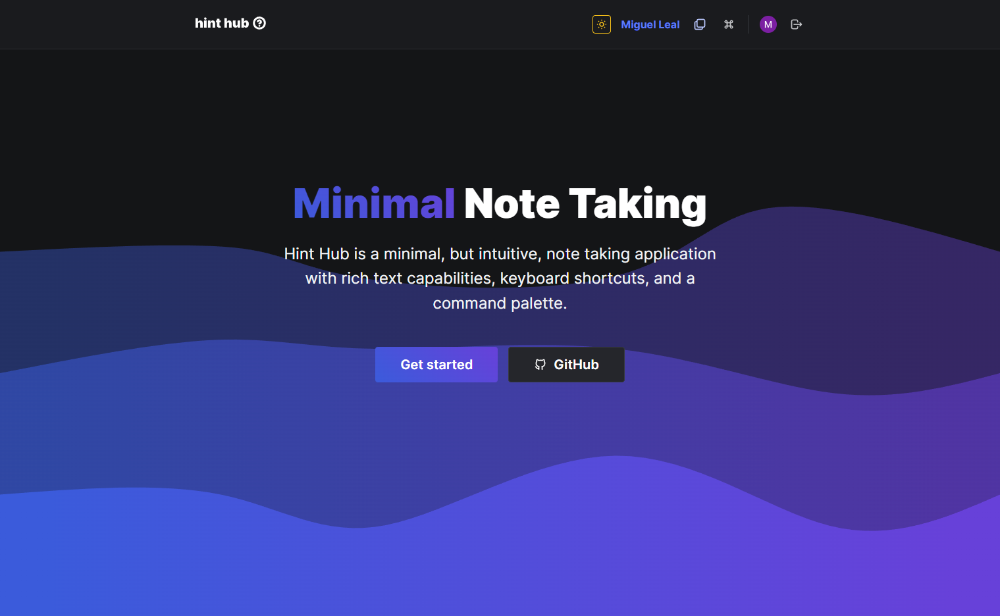
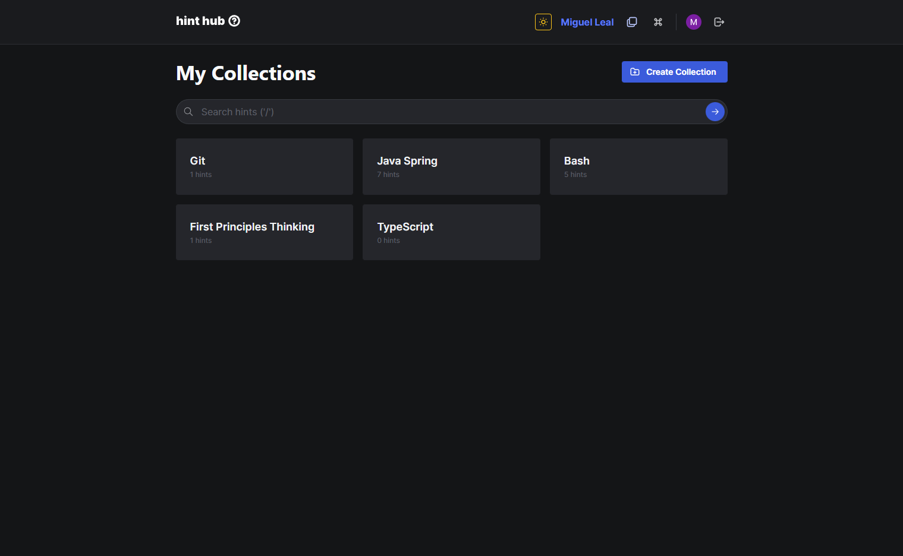
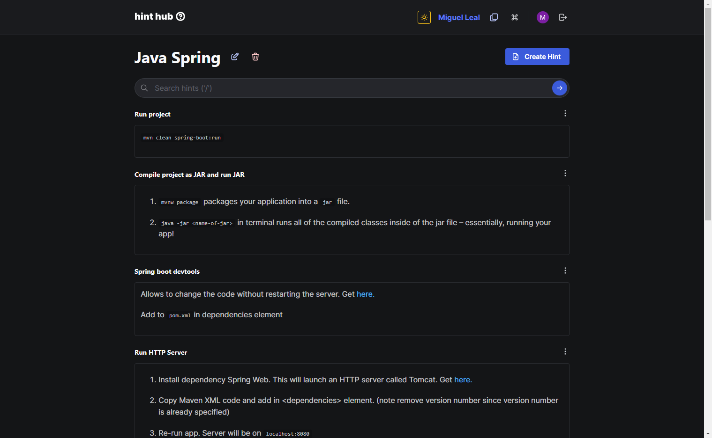
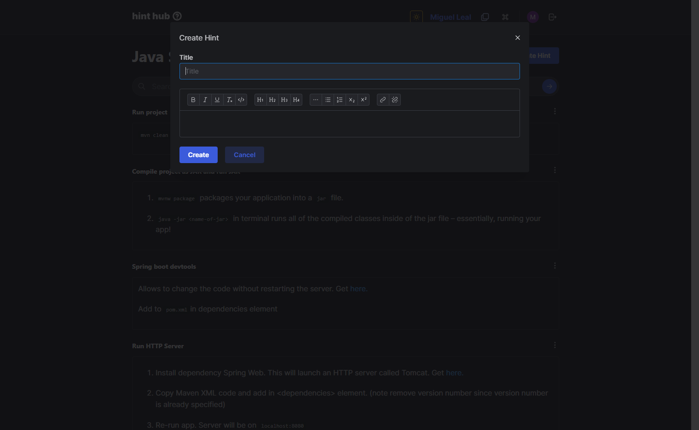

# Hint Hub
Hint Hub is a minimal, but intuitive, note taking application with rich text capabilities, keyboard shortcuts, and a command palette.

## Landing Page

## Organize notes in collections

## View notes / hints

## Create note / hint with rich text
